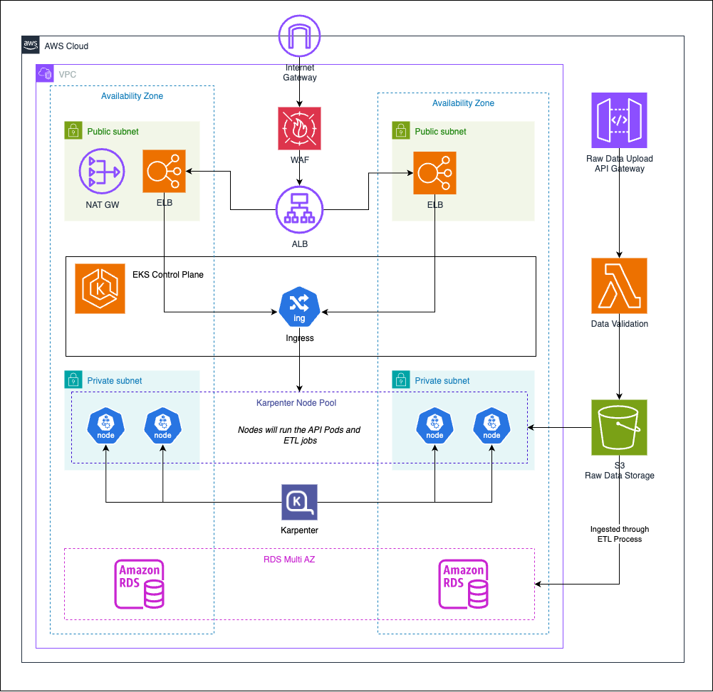

# Racing Data API

A FastAPI-based service that provides analytics on racing data, including summaries for circuits and drivers.

## Features

- **Circuit Analytics**: Circuit information including fastest lap times across all races and total races completed
- **Driver Analytics**: Driver statistics including podium finishes and total races entered
- **High-Performance ETL**: DuckDB data processing pipeline for fast analytics queries
- **Containerized Deployment**: Docker-ready with PostgreSQL backend
- **Interactive Documentation**: Automatic OpenAPI documentation generation

## API Overview

The API is built with FastAPI and provides RESTful endpoints for accessing racing analytics data.

### Why FastAPI?

- **Lightweight**: Minimal overhead compared to Flask & Django. 
- **Performance**: FastAPI is fast! Comparable to Node.js and Go.
- **Async by default**: Perfect for high I/O operations such as API calls and database queries.

### Endpoints

| Endpoint | Method | Description |
|----------|--------|-------------|
| `/drivers` | GET | List all driver summaries |
| `/drivers/{driver_id}` | GET | Get specific driver details by ID |
| `/circuits` | GET | List all circuit summaries |
| `/circuits/{circuit_id}` | GET | Get specific circuit details by ID |

### API Documentation

Once running, access the interactive API documentation at:
- **Swagger UI**: `http://localhost:8000/docs`
- **ReDoc**: `http://localhost:8000/redoc`

## Architecture

### Data Processing Pipeline

The application uses an ETL architecture designed for performance, scalability and maintainability:

1. **Extract**: Raw racing data is loaded into DuckDB tables
2. **Transform**: SQL analytics queries process and aggregate the data
3. **Load**: Final processed data is stored in either SQLite (local development) or PostgreSQL (production)

### Why DuckDB?

- **Performance**: Optimised for analytical workloads with complex SQL queries
- **Simplicity**: In-process analytical database requiring no server setup
- **Limitation**: Not designed for high-concurrency scenarios (hence the separate API database)

This architecture separates concerns: DuckDB handles heavy analytical processing while the API database (SQLite/PostgreSQL) serves fast, concurrent read queries utilizing the finalised datasets.

## Getting Started

### Prerequisites

Choose your preferred setup method:

**Docker (Recommended)**:
- Docker Desktop
- Docker Compose

**Local Development**:
- Python 3.12+
- pip
- uvicorn

### Docker Deployment

The fastest way to get started is using Docker Compose:

```bash
# Build and start all services
make up
```

This command will:
- Build the API and ETL containers
- Start a PostgreSQL database
- Run the data processing pipeline
- Launch the API server

**Access the API**:
- Drivers: http://localhost:8000/drivers
- Circuits: http://localhost:8000/circuits
- Documentation: http://localhost:8000/docs

### Local Development

For development or customization:

1. **Set up Python environment**:
   ```bash
   python -m venv venv
   
   # Linux/MacOS
   source venv/bin/activate
   
   # Windows
   source ./venv/Scripts/Activate.ps1
   ```

2. **Install dependencies**:
   ```bash
   pip install -r api/requirements.txt
   pip install -r etl/requirements.txt
   ```

3. **Run the application**:
   ```bash
   # Process data and populate database
   make run_pipeline
   
   # Start the API server
   make run_local
   ```

The API will be available at http://localhost:8000

## Make Commands
| Command | Action |
|-------|------|
| `make help` | view make commands|
| `make run_local` | Run FastAPI Locally |
| `make run_local_alt` | Run FastAPI locally on alternate port |
| `make up `| Build and run Docker Compose |
| `make down` | Stop Docker Compose |
| `make build` | Build Docker Compose |
| `make build_no_cache` | Build Docker Compose without cache |
| `make build_api` | Build API Dockerfile |
| `make build_etl` | Build ETL Dockerfile |
| `make run_pipeline `| Run ETL pipeline locally |
| `make restart` | Rerun ETL process inside Docker |

## Production Deployment

### Cloud Architecture Recommendations

**Data Processing**:
- Deploy ETL pipeline as Kubernetes Jobs or AWS Batch jobs.
- Trigger processing via file uploads to S3, manual trigger for AdHoc runs or on a schedule.
- Use S3 for raw data storage and versioning. Can be stored as CSV or converted to Parquet for faster processing.

**API Deployment**:
- Containerized deployment in Kubernetes for auto-scaling.
- Load balancer for high availability.
- PostgreSQL RDS for managed database service. Potentially leverage serverless to save costs.
- Alternative, use Postgres container with persistant storage inside EKS cluster. (Not recommended for critical workloads)

**Benefits**:
- Horizontal scaling based on demand.
- Separation of compute resources for ETL and API workloads.
- Managed database services for reliability and maintenance.

<details>
<summary><strong>Example Architecture Diagram</strong></summary>


</details>

### Infrastructure as Code
- **Terraform** for cloud infrastructure provisioning
- **Kubernetes manifests** or **Helm charts** for application deployment
- **CI/CD pipelines** for automated testing and infrastructure deployment
- **ArgoCD** for automated Kubernetes deployments

### Monitoring
- **Prometheus** - Monitoring overall cluster and node health
    - **Kube-state-metrics** - Collect metrics from Kubernetes objects, e.g. deployments, nodes and pods
    - **CAdvisor** - Monitoring resource usage and performance of containers
    - **Node Exporter** - Linux EKS Nodes
- **Loki** - Aggregating logs from containerised workloads
- **Alertmanager** - Handling alerts
- **Grafana** - Data visualation

### Security
- **Least privilege**: Any users or roles will only be granted the minumum access required to carry out functionality.
- **Secrets Management**: AWS Secrets Manager (or 3rd Party tools such as Doppler) can store sensitive values used by the application. External secrets operator can securely access these secrets from inside the Kubernetes cluster.
- **Networking**: API endpoints should only be accessed inside a private network and any public endpoints should to be tightly controlled and monitored.

### Build & Release Strategy
- Leverage blue-green deployments or canary releases.
- Automated image build pipelines to staging and production environments.
- Builds triggered based on branch e.g. develop to staging, main to production etc.
- Automated testing in pipelines for data and code validation.

## Project Structure

```
├── api         # FastAPI Application
│   ├── __init__.py
│   ├── __pycache__
│   ├── database.py
│   ├── docker
│   ├── main.py
│   ├── main.py.bck
│   ├── models
│   ├── requirements.txt
│   ├── routers
│   └── schemas
├── data        # Local data storage
│   ├── final
│   └── raw
├── docker      # Docker configuration
│   └── docker-compose.yml
├── etl         # Data processing pipeline
│   ├── __init__.py
│   ├── docker
│   ├── duckdb_pipeline.py
│   ├── queries.sql
│   └── requirements.txt
├── Makefile
├── README.md
```